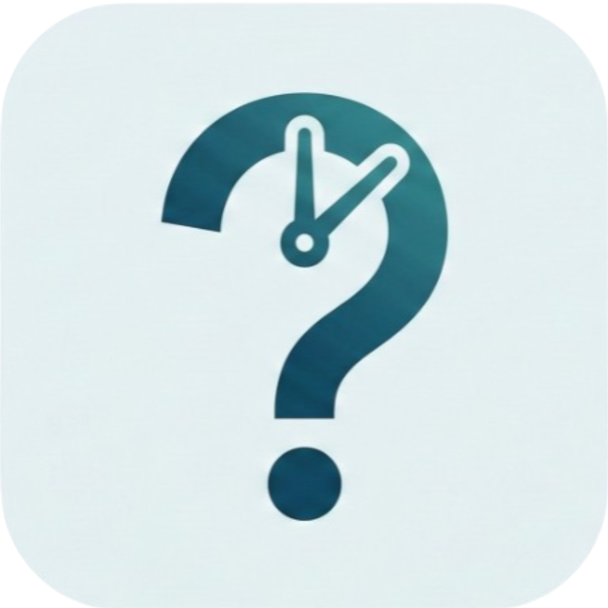

<div align="center">
  
  <h1>WhereDid<strong>My</strong>TimeGo?</h1>
  <p><strong>An open-source, fully offline, secure time-tracking, task-planning, and expense-tracking mobile application — now with on-device AI.</strong></p>
</div>


## 📌 What is WhereDidMyTimeGo?
We all plan our days, but reality often goes differently. *WhereDidMyTimeGo* is designed to bridge the gap between what you *thought* you would do and what you *actually* did. With a sleek UI and easy-to-use logging mechanism, taking control of your daily routine has never been easier.

This application is completely **open source**! Feel free to fork it, modify it, compile it yourself, and adapt it to your workflow.

<br clear="both">
<hr>

## ✨ What's New

### 🤖 On-Device AI (Powered by Gemma)
All AI features run **100% locally** using [flutter_gemma](https://pub.dev/packages/flutter_gemma). No data ever leaves your device.

| Feature | How to use |
|---|---|
| **AI Schedule** | Tap the `✦ Schedule` button on the home screen and type naturally — *"team standup tomorrow at 10am for 30 min"*, *"gym session Friday evening"*. The AI parses the date, time, duration, and title and creates the task instantly. |
| **Today's Brief** | Tap the `[AI] Today's Brief` pill button in the home screen header. The AI reads your logged activities for the day and generates a concise personal summary of how your time was spent. |
| **Auto-categorise Expenses** | When you add a new expense, the AI silently classifies it into one of the five categories (Food, Travelling, Clothes, Gadgets, Medical) in the background. You can always override it manually. |

> **Setup:** On first launch, go to **Settings → AI Model** and import a compatible Gemma `.task` model file (e.g. `gemma-2b-it-cpu-int4.task`). Once loaded, all three AI features activate automatically.

<br>
<hr>

### 💸 Expense Tracking
A dedicated **Expenses** tab (wallet icon in the bottom nav) lets you track every rupee you spend with zero friction.

**Adding & editing expenses:**
- Tap `+` to add an expense — enter title, amount, optional note, date/time, and pick a category.
- Tap any transaction to edit it. In the edit sheet, tap **Delete** (red button, top-right) to remove it.
- The AI auto-suggests the category as soon as you save; change it any time via the edit sheet.

**Viewing & filtering:**
- Switch between **Day**, **Week**, and **Month** tabs. Use `‹` `›` to navigate to previous periods.
- Transactions within a period are grouped by day (in Week/Month view).
- Tap the sort toggle (top-right of the header card) to switch between *by date* and *by amount*.

**Analytics:**
- Each tab shows a bar chart of spending bucketed by time (4-hour blocks for Day, daily bars for Week, weekly bars for Month).
- The header card shows this month's total, dominant category, and a multi-colour category breakdown bar.

**CSV Export:**
- Tap the green **📗** button (next to the `›` arrow) in any tab to export the current period's transactions as a `.csv` file.
- Files are saved to the **Downloads** folder on Android, or the current directory on desktop.
- Filename format: `expenses_10_Mar_2026.csv` (Day) · `expenses_W10_Mar_2026.csv` (Week) · `expenses_Mar_2026.csv` (Month)

**Home screen Spending Pulse:**
- A **Spending Pulse** card on the home screen gives you an at-a-glance view: today's total, a 7-day sparkline, daily average, month-to-date total, projected month-end spend, and the biggest spending category.

<br>
<hr>

### 📈 Investment & Wealth Tracking
A fully integrated **Investments** tab allows you to track both your Mutual Funds (SIPs) and Stocks seamlessly in one place.
- **Dynamic Stock Search:** Search for real global stocks and tickers live using the newly integrated Yahoo Finance lookup.
- **Combined Portfolio Analytics:** View your complete net worth broken down into beautiful gradient charts showing the exact split between your systematic SIPs and one-time stock buys.
- **Easy Logging:** Quickly log new SIPs or stock purchases with dedicated, streamlined modal sheets.

<br>
<hr>

### 📔 Immersive Daily Journal
Take a moment to reflect on your day with a built-in digital diary.
- **Beautiful Interface:** Access your journal instantly via the prominent, tilted gradient card natively sitting on your home screen.
- **Historical Memory:** Keep a chronological record of your daily thoughts, ideas, and accomplishments cleanly integrated alongside your time logs and expenses.

<br>
<hr>

## 🚀 Features


### 📅 Plan Your Day
Schedule your tasks with an interactive and highly flexible grid interface. Plan your morning routine, your deep work blocks, and your evenings effortlessly. 

Whether you're allocating standard 30-minute chunks or sprawling 4-hour deep work sessions, the beautiful dynamic timeline neatly stacks your commitments.

<br clear="both">
<hr>


### ⏱ Reality Tracking
Throughout the day, the app will periodically prompt you via the notification center (e.g. every 15, 30, or 60 minutes). Did you actually finish that task, or did you get distracted? Just type your answer directly from the notification tray!

- **No app-opening required:** Reply natively via the notification panel.
- **Continuity guaranteed:** If you miss a ping, the app effortlessly copies your previous activity so there are no awkward empty gaps.
- **Log Now:** Need to log a sudden interruption? Use the bright "Log Now" button directly on the dashboard.

<br clear="both">
<hr>


### 📊 Analyze It All & Manage Todos
Your dashboard dynamically compares your scheduled tasks to your actual logged activities, generating a beautiful animated feed that breaks down exactly what you accomplished today.

**📓 Scratchpad & Todos:** Jot down quick thoughts, ideas, or to-dos in the integrated Notes section without having to context-switch to another app. Organise them into **folders** (collapsed by default for a clean view). It helps keep your workflow smooth and uninterrupted.

<br clear="both">
<hr>

### 🔒 100% Offline & Secure
All your data lives natively on your device. Period.
Your time logs, notes, and expenses are completely private. If you ever need to change devices, simply **export** your data (Settings → Export) to a single JSON file containing all logs, schedules, todos, folders, and expenses, then **import** it on your new device.

## 💻 Tech Stack
- **Framework:** Flutter / Dart
- **State Management:** Provider
- **Storage:** SharedPreferences + local JSON file
- **AI / ML:** flutter_gemma (on-device Gemma model, INT4 quantised)
- **Notifications:** flutter_local_notifications (inline reply support)

## 🛠 Usage & Installation

Because this app is focused on full privacy and zero tracking, the best option is to review the code and compile it yourself!

1. **Fork the repo** and clone it to your local machine:
    ```bash
    git clone https://github.com/your-username/WhereDidMyTimeGo.git
    ```
2. **Install Dependencies:**
    ```bash
    flutter pub get
    ```
3. **Run or Build:**
    ```bash
    flutter run
    # OR build a release APK for Android
    flutter build apk --release
    ```
4. **Enable AI features:** Download a compatible Gemma model (`.task` format, e.g. `gemma-2b-it-cpu-int4.task`) and import it via **Settings → AI Model** on first launch.

## 🤝 Contributing
Contributions, issues, and feature requests are welcome! 
Feel free to check out the [issues page](../../issues).

## 📄 License
This project is completely Open Source. Fork it, improve it, and use it absolutely free of charge!
